## 0.Important note:  
- This repo is trying to detect the bad smells during the develop process of project 1, csc 505, 15spring, ncsu  
- All of the project names and members have been subsitituted by the numbers, due to the privacy consideration  
- Contact: Jianfeng Chen (jchen37@ncsu.edu)

## 1.Collection
This section will introduce how to collect the data or records during the developing process. I will collect three basic types of data-- issues, commits and milestones.  

All of the collection codes are modified from [gitable.py](https://gist.github.com/timm/a87fff1d8f0210372f26). Github token is required when applying the github API. In this repo, my token has been hiden.

**Collecting Issues**

Issues are a great way to keep track of tasks, enhancements, and bugs for the projects. Through it, we can detect or predict some bad smells. To collect the issues for a project, we can put the dump https://api.github.com/repos/org_name/repo_name/issues/events and them parse the return JSON. For example, I want to get the issues for my own project, I should use the dump https://api.github.com/repos/smartSE/constraintAnalysis/issues/events.  

If it is successful, I can get all the information about the issues, tagged as "id", "url", "html_url", "state", "title", "body", "user", "label", "milestone", "comments", etc.  

This report will discuss how to parse these information in the following section.

**Collection Milestones**

Typically the developer set a milestone correspond to a project, feature, or time period. Consequently, milestone is an important information in analysing the bad smell.

Similar to collecting the issues, one can fetch the milestones by using the Github API link: https://api.github.com/repos/org_name/repo_name/milestones . Again, take my own project as an example, the dump for extracting my project milestone should be https://api.github.com/repos/smartSE/constraintAnalysis/milestones?state=all. The state here can be all/closed/ open(default). 

The information for a single milestone including "id", "url", "creator", "title", "description", "create_at", "closed_at", etc.

**Collecting Commits**

There are several commits in a project. Through tracking the commits, we can detect or predict many bad smells.
 Similar to the former two collection, we should use the link https://api.github.com/repos/org_name/repo_name/commits . For example, to get the commits for my own project 1, I should use https://api.github.com/repos/smartSE/constraintAnalysis/commits.

Many parameters can be attached to the url so that we can find more precise result, see the [github api document](https://developer.github.com/v3/repos/commits/).

Common information for a commit includes "url", "author", "committer", "parents", etc. 

**Collecting Labels**

Labels are the tags for the issues, through which the developer can classify their issues. 

Similar to the former two collection, we should use the link https://api.github.com/repos/org_name/repo_name/labels . For example, to get the commits for my own project 1, I should use https://api.github.com/repos/smartSE/constraintAnalysis/labels

Many parameters can be attached to the url so that we can find more precise result, see the [github api document](https://developer.github.com/v3/issues/labels/#list-all-labels-for-this-repository)

Common information for a commit includes "name", "url", "color", etc. 

## 2.Anonymization
The main purpose for this repo is to find the bad smells for others, which are widely existed in our own development process. Thus it is the conclusion that matters. All of the names will be hidden to protect the privacy. That is, developers are called "D1", "D2", "D3"; groups are called "G1", "G2", "G3".

I defined a mapping method to substitute the real names. It was simply applying "str.replace(s1,s2)". Obviously, this function is not published in this repo--it contains the mapping relationship.

## 3.Tables
All of the results are stored in different spreadsheets. These spreadsheets are in CSV format, which is easily written by format and analyzed by EXCEL. All of the figures in this repo were created by MS Excel. 

## 4.Data
The following table shows how much data I collected for the later analysis.

|No|Data set|G1|G2|G3|
|------|-------|--------------|--------------|--------------|
|1|Commit Record|510|182|170|
|2|Issue Record|69|93|78|
|3|Milestone Record|5|5|7|
|4|Labels|11|8|9|

## 5.Data Samples

**1.Commit record**

|Committer|Commit time(epoch secs)|
|---------|-----------------------|
|M0|1428442378|
|M1|1428267799|

The actual collected data can be found here:  
* [project1](https://github.com/smartSE/badsmell/blob/master/commit/proj1.csv)
* [project2](https://github.com/smartSE/badsmell/blob/master/commit/proj2.csv)
* [project3](https://github.com/smartSE/badsmell/blob/master/commit/proj3.csv)

The commit record mainly focuses on the commit history during the development of software. It contains the committer, commit time.

**2.Issue record**

|Issue Id|State|Creator|Create time|Labels|Milestone due|Last update|
|--------|-----|-------|-----------|------|-------------|-----------|
|65|closed|M2|1428200078|['enhancement']|1428120000|1428205800|
|66|closed|M3|1428250364|['develop']|-1|1428373148|

The actual collected data can be found here:  
* [project1](https://github.com/smartSE/badsmell/blob/master/issue/proj1.csv)
* [project2](https://github.com/smartSE/badsmell/blob/master/issue/proj2.csv)
* [project3](https://github.com/smartSE/badsmell/blob/master/issue/proj3.csv)

The issue records are used to trace the issue publication in the development of the software. All times with '-1' indicates "not applicable"  

**3.Milestone record**

|Milestone id|Title|Create time|Due|
|------------|-----|-----------|---|
|2|V1|1424905758|1425960000|
|3|Final|1424820465|1428206400|

The actual collected data can be found here:  
* [project1](https://github.com/smartSE/badsmell/blob/master/milestone/proj1.csv)
* [project2](https://github.com/smartSE/badsmell/blob/master/milestone/proj2.csv)
* [project3](https://github.com/smartSE/badsmell/blob/master/milestone/proj3.csv)

Milestone is an important develop tool. All times with '-1' indicates "not applicable/not set"  

**4.Label record**
|Name|Url|Color|
|bug|https://api.github.com/repos/g2/labels/bug|fc2929|
|team|discussion|https://api.github.com/g2/labels/team%20discussion|eb6420|

The actual collected data can be found here:  
* [project1](https://github.com/smartSE/badsmell/blob/master/label/proj1.csv)
* [project2](https://github.com/smartSE/badsmell/blob/master/label/proj2.csv)
* [project3](https://github.com/smartSE/badsmell/blob/master/label/proj3.csv)

## 6.PART I. Feature Detection and Results

### Overview
|No.|Features|
|---|--------|
|1|Commit distribution for the whole team|
|2|Commit for a single person|
|3|Not in-time issue|
|4|Issue creator distribution|
|5|Weekly issue distribution|
|6|Labelled issue distribution|
|7|Number of not labelled issue|
|8|Not closed issue|
|9|Label name|
|10|Number of issues without milestone|
|11|Number of milestones|
|12|Milestone duration|

**1.Commit distribution for the whole team**

The commit distribution can be fetched through the dataset 1(commit record). At this time, I ignore the committer. Since all of the times are represented by the epoch seconds in dataset1. Modification for these time is needed. I need to count the total number of weekly commits. The statistic method is as follows. Detail code can be found [here](https://github.com/smartSE/badsmell/blob/master/commit/commitDis.py)

```python
csvfile = file('proj2.csv','rb')
reader = csv.reader(csvfile)
t = []
for line in reader:
   [a,b] = line
   t.append(int(float(b)))
t.sort()
week = []
total_week = (t[-1]-t[0])/(7*24*3600)
end = []
for i in range(total_week):
   end.append(t[0]+(i+1)*7*24*3600)

c = 0
for x in t:
   if  x < end[0]:
      c += 1
week.append(c)

for alpha in range(1,total_week):
   c = 0
   for x in t:
      if x >= end[alpha-1] and x < end[alpha]:
          c+= 1
   week.append(c)
print(week)
csvfile.close()
```

RESULT:  
The following figures shows the result for the commit distribution of these groups.
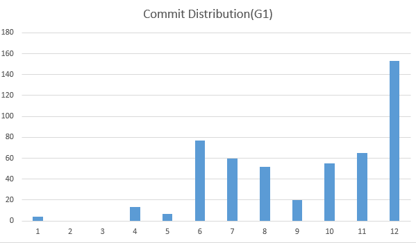
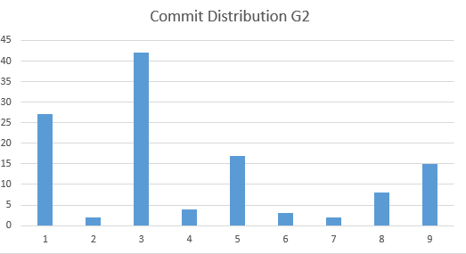
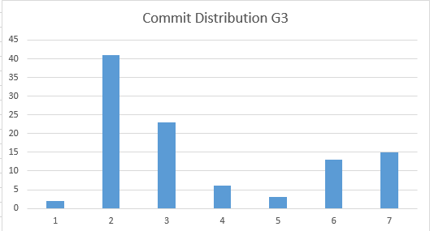

**2.Commit for a single person** 

Another important feature from the commit history is the commit rate for one single person. In the project team, each member should have equal contribution.  

The code for fetching commit rate for each person can be found [here](https://github.com/smartSE/badsmell/blob/master/commit/personalCommitRate.py).  

RESULT:  
The following figures shows the commit rate for each person.

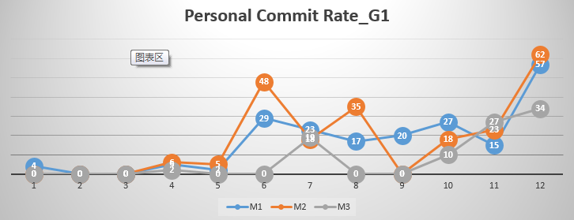
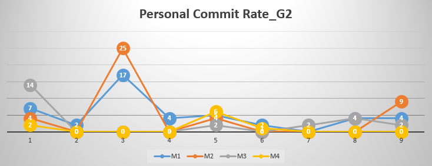
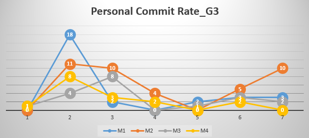

**3.Not in-time issue**

Not in-time issue is the issue which is updated or not closed after the milestone due. Milestone is an important time point to control the develop process; if one can not finish the milestone, that means: 1) they underestimated the project, or 2) there are some problems during their coding and testing process.  

The following function is used to count the not in-time issues. Detail code can be found [here](https://github.com/smartSE/badsmell/blob/master/issue/notintime.py)

```python
#project 1
csvfile = file('proj1.csv','rb')
reader = csv.reader(csvfile)
t = []
count = 0
for line in reader:
   [a,b,c,d,e,f,g] = line
   if b == 'open':
      count += 1
      continue
   if int(float(f)) > 0 and int(float(g)) > int(float(f)):
      count += 1
print(count)
csvfile.close()
```

RESULT:  
```
Project 1: 28  
Project 2: 51  
Project 3: 11
```

**4.Issue creator distribution**

Here we want to see the distribution of issue creator. During the develop process, any problems should be raised in the issue. Issue is a fantastic way to communicate within a team. The issue creator distribution can be count as follows. Detail code can be found [here](https://github.com/smartSE/badsmell/blob/master/issue/issueCreatorDis.py)

```python
#project 1
csvfile = file('proj1.csv','rb')
reader = csv.reader(csvfile)
t = []
creator = set([])
for line in reader:
   [a,b,c,d,e,f,g] = line
   creator.add(c)

dis = []
for mm in creator:
   count = 0
   csvfile.seek(0)
   for line in reader:
      [a,b,c,d,e,f,g] = line
      if c == mm:
	  count += 1
   dis.append(count)
print(dis)
csvfile.close()

```
RESULT:
Project 1: [48, 8, 13]  
Project 2: [1, 54, 7, 19, 1]
Project 3: [50, 12, 0, 16]
```

**5.Weekly issue distribution**

Weekly issue distribution is anther important issue too. From Feb 1, 2015, we counts the number of issues for the following weeks. The code to fetch this feature is as follows. Detail code can be found [here](https://github.com/smartSE/badsmell/blob/master/issue/weeklyIssueDis.py)

```python
#project 1
csvfile = file('proj1.csv','rb')
reader = csv.reader(csvfile)
t = []
week = []
for line in reader:
   [a,b,c,d,e,f,g] = line
   x = long(d)
   week.append(int(x/604800-2351))
week.sort()
frequency = []
for i in range(1,max(week)):
   count = 0
   for p in week:
      if p == i:
          count += 1
   frequency.append(count)
print(frequency)
csvfile.close()

```

RESULT:  
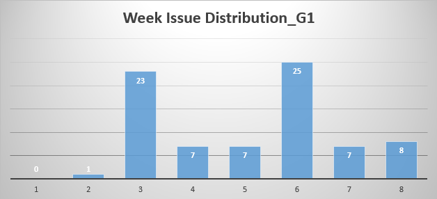
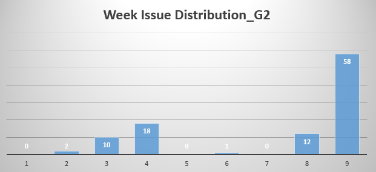
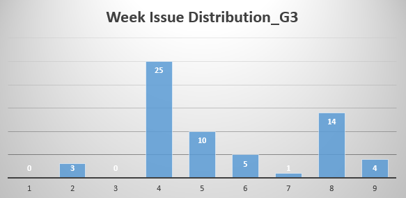


**6.Labelled issue distribution**

Now we focus on the labels. Through the data set 2(issue record), we can fetch the label for the issue. But whether each label has the same number of issues. Some not-used labels or miner used labels are not helpful. This feature counts the number of labels with some specific issue. The function for fetching this feature is as follows. Detail code can be found [here](https://github.com/smartSE/badsmell/blob/master/issue/labelsDis.py)

```python
def splits(e):
  result = []
  strs = ''
  for c in e:
     if c != ',' and c != '[' and c != ']' and c != '\'':
	strs += c
     else:
        if len(strs) >0 and strs != ' ':
           result.append(strs)
	strs = ''	
  return result


print("ISSUE CREATOR DISTRIBUTION===========")
#project 1
csvfile = file('proj1.csv','rb')
csvfile2 = file('labelDis1.csv','w')
reader = csv.reader(csvfile)
writer = csv.writer(csvfile2)
t = []
labels = set([])
for line in reader:
  [a,b,c,d,e,f,g] = line
  for ll in splits(e):
      labels.add(ll)

for la in labels:
   count = 0
   csvfile.seek(0)
   for line in reader:
      [a,b,c,d,e,f,g] = line
      for ll in splits(e):
           if ll == la:
               count += 1
   writer.writerows([[la,count]])
csvfile.close()
```

RESULT:
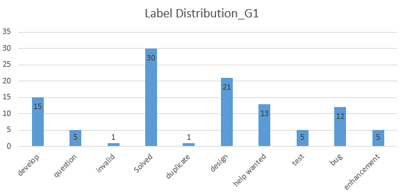
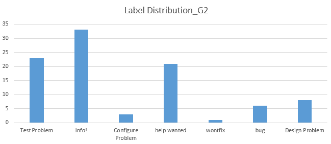
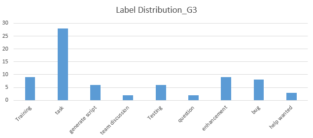

**7.Number of not labelled issue**

The tag(label) in one issue can help fasten others to find the proper issue, thus promote the communication within a team. The not-labelled issues are not a good thing. In this feature, we want to count the number of not labelled issues. Function for fetching is as follows. Detail code can be found [here](https://github.com/smartSE/badsmell/blob/master/issue/nolabelIssue.py)

```python
#project 1
csvfile = file('proj1.csv','rb')
reader = csv.reader(csvfile)
t = []
labels = set([])
count = 0
for line in reader:
  [a,b,c,d,e,f,g] = line
  if e == '[]':
      count += 1
print(count)
csvfile.close()
```

RESULT:
```
Project 1: 6  
Project 2: 26  
Project 3: 36
```

**8.Not closed issue**

One issue should be closed after it is solved or the developers do not plan to solve it. The open issue indicates the problem to be figure out. Now all of the projects are ended. The issues should be all closed. This feature count the issue which has not yet closed. The function is as follows. Detail code can be found [here](https://github.com/smartSE/badsmell/blob/master/issue/nocloseIssue.py)

```python
csvfile = file('proj1.csv','rb')
reader = csv.reader(csvfile)
t = []
labels = set([])
count = 0
for line in reader:
  [a,b,c,d,e,f,g] = line
  if b != 'closed':
      count += 1
print(count)
csvfile.close()
```

RESULT:
```
Project: 1  
Project: 0  
Project: 0
```

**9.Label name**

Here we focus on the name of labels. A meaningful name can promote the developing process. The label name can be collected as the follow function. Detail code can be found [here](http://sss)

```python
csvfile = file('proj1.csv','rb')
reader = csv.reader(csvfile)
names = []
for line in reader:
    [a,b,c] = line
    names.append(a)
names.sort()
print(names)    
print("===============")
csvfile.close()
```

RESULT:  
```
===LABEL NAMES#===========  
['Solved', 'bug', 'design', 'develop', 'duplicate', 'enhancement', 'help wanted', 'invalid', 'question', 'test', 'wontfix']  
===============  
['Configure Problem', 'Design Problem', 'Test Problem', 'bug', 'fixed', 'help wanted', 'info!', 'wontfix']  
===============  
['Testing', 'Training', 'bug', 'enhancement', 'generate script', 'help wanted', 'question', 'task', 'team discussion']  
===============  
```

**10.Number of issues without milestone**

The milestone set up a deadline for solving the issue. This is a very helpful tool. This feature counts the number of issues without milestones. The following function is corresponded to this. Detail code can be found [here](https://github.com/smartSE/badsmell/blob/master/issue/nomilestone.py)

```python
csvfile = file('proj1.csv','rb')
reader = csv.reader(csvfile)
t = []
labels = set([])
count = 0
for line in reader:
  [a,b,c,d,e,f,g] = line
  if f == '-1':
      count += 1
print(count)
csvfile.close()
```

RESULT:  
```
Project: 13  
Project: 29   
Project: 42  
```

**11.Number of milestones**

This feature is to get how many milestones the developers have created. Typically one milestone represents one developing step. Too less milestones is not a good thing. The number of milestones can be fetched as follows. Detail code can be found [here](https://github.com/smartSE/badsmell/blob/master/milestone/milestoneNum.py)

```python
#project 1
csvfile = file('proj1.csv','rb')
reader = csv.reader(csvfile)
count = 0
for line in reader:
    count += 1
print(count)
csvfile.close()
```

RESULT:
```
PROJECT 1: 5
PROJECT 2: 5
PROJECT 3: 7
```

**12.Milestone duration**

For each milestone, this feature indicates the milestone duration. Either too long or too short duration is not good. This feature can be fetched by the following function. Detail code can be found [here](https://github.com/smartSE/badsmell/blob/master/milestone/milestoneDuration.py)

```python
csvfile = file('proj1.csv','rb')
reader = csv.reader(csvfile)
for line in reader:
    [a,b,c,d] = line
    days = (long(float(d))-long(float(c)))/(24*3600)
    print(b+":"+str(int(days)))
print("===============")
csvfile.close()
```

RESULT:
```
===REPO MILESTONE #===========  
Beta Launch :9  
V1:12  
V2:26  
System test and Report:24  
Final release:10  
===============  
Test points:-16497  
Basic Service and Test:10  
Small Scale Test and Comparison:34  
Large Scale Test:39  
Final:39  
===============  
Data Collection and Preliminary Analysis:13  
Tasks for Week#3:13  
Tasks for 02/27:7  
Milestone-03/07:3  
105 Model:10  
Milestone-03/15:5   
Milestone-03/30:9  
===============
```


## 7.PARTII. Bad Smells Detector and Results

There may exist many bad smells during the developing process. In this section, I will discuss some of them basing on the features generated above. Some bad smells can derive from one single feature, while others may need to derive from two features or more.  

**1.Uneven commit distribution**  

Through the result of feature1(Commit distribution for the whole team), we can easily know that, to some extend,  the commit distribution is not even for each team. To confirm this, I use the (standard deviation/total commit*project duration) to see whether the commit distribution is even.  
Code for this detector can be found [here](https://github.com/smartSE/badsmell/blob/master/commit/commitStandardDeviation.py)

RESULT:  
project 1: 0.0843137254902  
project 2: 0.071004659249  
project 2: 0.0751008549106  

Through this result, we can confidently make a conclusion that all of the three teams had uneven commit history, especially for the group for project 1.

**2.Super Leader** 

A super leader may be harmful for a team. The super leader did most of the jobs in a team, which violates the principle of co-operation. For instance, during a team meeting, the team may suffer from cheerleader effect. The following [function](https://github.com/smartSE/badsmell/blob/master/commit/superLeaderDetector.py) is the detector for this.

```python
def detectSuperLeader(weeklyCommit, totalCommit):
   if sum(weeklyCommit) > totalCommit*0.3:
       return True
   return False
```

RESULT:  
project 1: False  
project 2: False  
project 3: False  

We're glad to see that there is no super leader among these groups.

**3.Passenger**

Opposite to the super leader, the passenger in a team does more harm in the project. They did not play actively in the developing process and thus reduce the quality of the product/software. We define the passenger as follows:  
The commit for him is less than 20% of the total commit; OR  
There were many weeks that they did not have any commit

The detector for the passenger can be found [here](https://github.com/smartSE/badsmell/blob/master/commit/passenger.py)

```python
def isPassenger(weekCommit, totalCommit)
    if sum(weekCommit) < totalCommit * 0.2:
	return True
    c = 0
    for i in weekCommit:
       if i == 0:
           c += 1
    if c >=0.25*len(weekCommit):
        return True
    reture False
```

RESULT:
```
G1-M1: High commit proportion. Not passenger  
G1-M2: High commit proportion. Not passenger  
G1-M3: Zero weekly commit warning. Possible Passenger!  
G2-M1: High commit proportion. Not passenger  
G2-M2: High commit proportion. Not passenger  
G2-M3: Zero weekly commit warning. Possible Passenger!  
G2-M4: Zero weekly commit warning. Possible Passenger!  
G3-M1: High commit proportion. Not passenger  
G3-M2: Zero weekly commit warning. Possible Passenger!  
G3-M3: Low commit proportion. Possible passenger!  
G3-M4: Low commit proportion. Possible passenger!
```

One should notice that this result is consistent to our intuition.

**4.Poor time management**

Time management including time/effort estimation and plan execution management. Now I can't distinguish them. However, any one of these reasons can lead to overdue issues. The not-in-time tasks do harm to the software developing. Especially when many issues are overdue.

The following [function](https://github.com/smartSE/badsmell/blob/master/funcs/poorTime.py) is a detector for poor time management. This detector is mainly based on the feature 3

```python
def poorTimeManageDetector(overdue, totalIssue):
   if overdue/totalIssue > 0.15:
       return True
   else:
       return False

```

RESULT:
```
Project 1: Poor Management  
Project 2: Poor Management  
Project 3: Poor Management
```

**4.Not number label**

As was said by Dr. Menzies in the lecture, numbering the labels is a good hibit. The following [function](https://github.com/smartSE/badsmell/blob/master/funcs/numberName.py) can check whether the labels has been numbered.

```python
def numberLabelDetector(labels):
    for label in labels:
        if label[0] >= '0' and label[0] <= '9':
             continue
	else:
             return False
    return True
```

RESULT
```
Project 1: Not numbered  
Project 2: Not numbered  
Project 3: Not numbered  
```

All teams ignored this!!

**5.Poor Issue management**

Issue management is essential too. They should be closed in time. Also, one should set up a label for it. Consequently, I wrote a detector for detecting poor issues. The [code](http:??) as follows:  

```python
def poorIssueDetector(totalIssue, notLabelIssue, notcloseIssue):
    if notcloseIssue > 0:
	return True
    if notLabelIssue > 0.2*totalIssue:
        return True
    return False
```

RESULT:
```
Project 1: Poor issue management(slightly.)  
Project 2: Normal  
Project 3: Poor issue management(too many non-labelled issues)
```

**6.Lacking milestones**


## 8.PARTIII. Early Warning and Results
